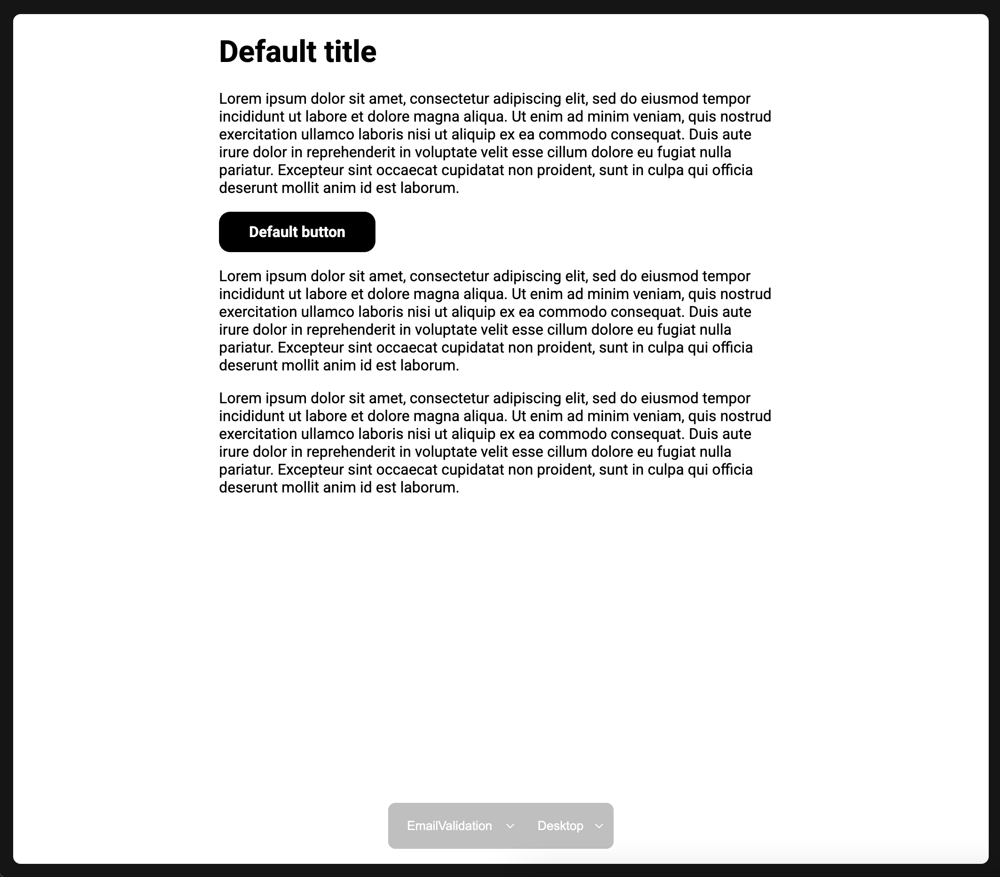

# Template Forge

A simple tool to allow better developer experience around templates generation on top
of [handlebars-rust](https://github.com/sunng87/handlebars-rust).

Includes both production ready template generation and a server to get a preview with default variables under
`server` feature flag.



## Examples

- [hotreload](./examples/hotreload.rs), shows how you can start the server to get a preview of your templates.
  ```bash
  cargo run --example hotreload --features server
  ```
- [advanced](./examples/advanced.rs), shows how `Forge` is used in a production context.
  ```bash
  cargo run --example advanced
  ```